# Taskmaster

## Overview

This repository includes an Android app that will be the main focus of the second half of the 401 course. over time this will grow to be a fully-featured application.

## Architecture

The programing language used to build this project is java and using the Android Studio to complete it.

## Lab: 26 - Beginning TaskMaster

This lab is an introduction to Android and how to use the Android Studio. In this lab I create three activities, The Main Activity, Add Task Activity and All Task Activity.

### Main Activity

It is the home page which contains an image and two buttons each one starts a new activity when click on it.

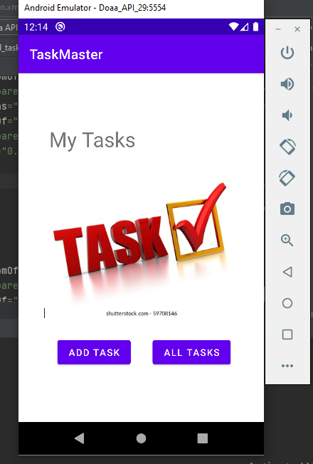

### Add Task Activity

When the user click on `ADD TASK` button from home page it will take The user to this page(*Add Task Page*). In this page the user can add a task title and a description and after that can click on th `ADD TASK` button.

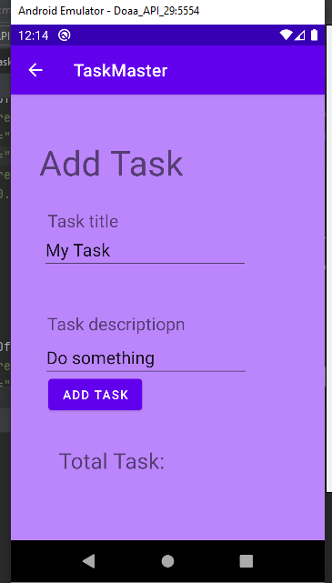

When the user click on the `ADD TASK` button it will show a message that the task is submitted.

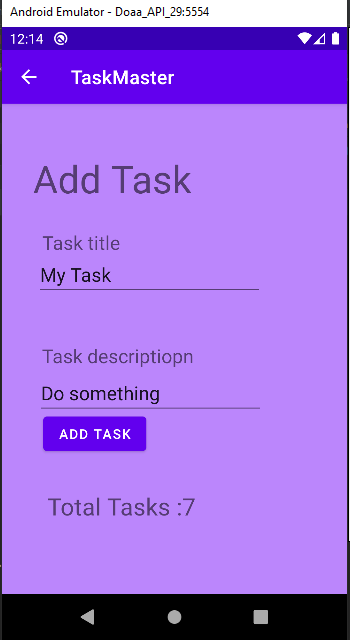

### All Task Activity

When the user click on `ALL TASK` button from home page it will take The user to this page(*All Task Page*). This page contains an image.

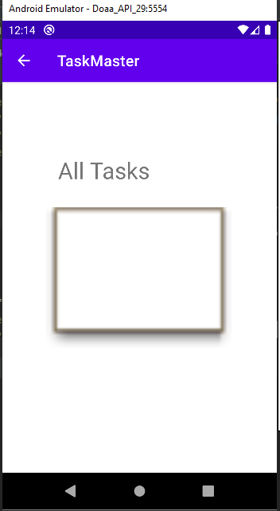

## Lab: 27 - Data in TaskMaster

In This lab added three buttons on the main page, each button for one task that takes the user to the task detail page when the user clicks on it. Also, added a setting button on the home page that takes the user to the setting page.

### Setting Activity

This page contains a fild which the user can put his/her name and click on save buttons to save the name.

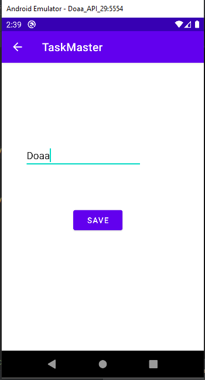

### Main Activity

The home page contains new four buttons. The first three buttons for tasks, Each button takes the user to a different task detail page. and the fourth button for the setting page that I showed you above. Also, the name that the user wrote on the setting page appears at the top of the main page.

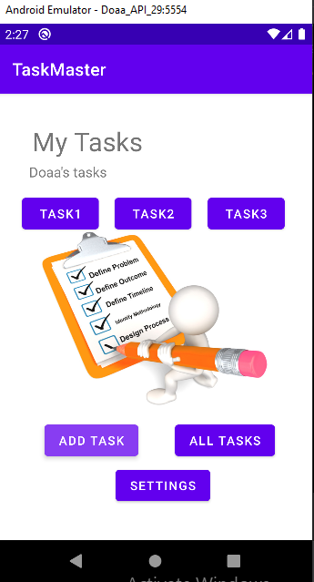

### Task Detail Activity

Task detail page appears when the user click on each task on the home page.

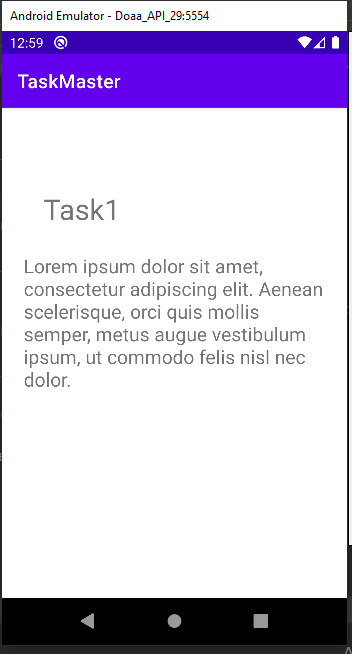

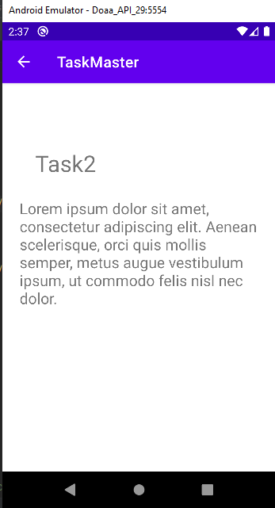

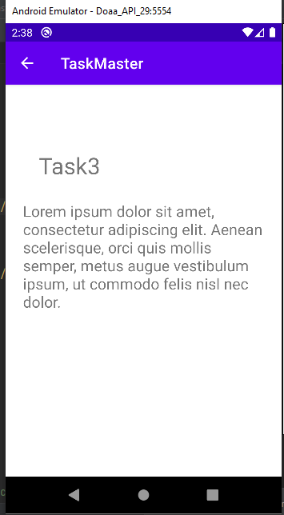

## Lab: 28 - RecyclerView

In this lab I used the `RecyclerView` to view all tasks in the home page as the list. 

### Main Activity

I refactored the homepage to show all the tasks as the list and the user can scroll down or up to view the tasks.

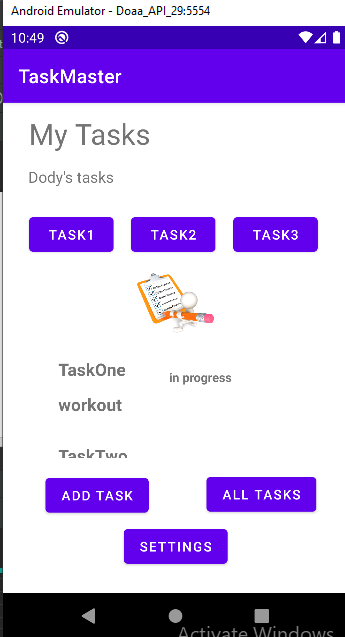

And also when the user clicks on any task, it will move him/her to the task details page.

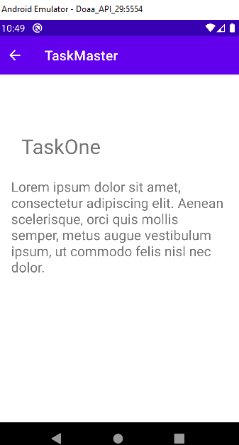

## Lab: 29 - Room

In this lab, I added a Room database to save the tasks and the details of tasks and get data from it, and let the recycler view take the data from the room database. 

### Add Task Activity
On this page, Added a new field in which can the user writes the title and description and state of the task.

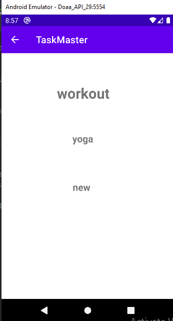

### Main Activity

 This is the home page and it conains tasks and each task has descreption and state

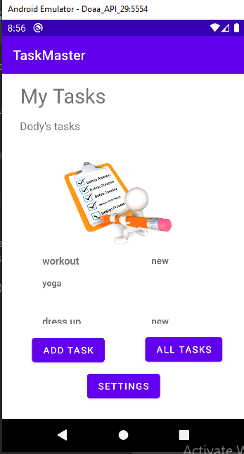

## Lab 31: Espresso and Polish

* In This lab I tets the code by using Espresso test.

* I created 3 test:

1. `elementsUI()`

To test the important UI elements are displayed on the Add Task page.

2. `addTaskFun()`

To test if you edit the user’s username, and then assert that it says the correct thing on the homepage.

3. `displayTaskName()`

To test when you tap on a task, and then assert that the resulting activity displays the title, body and state of that task in task detail page.

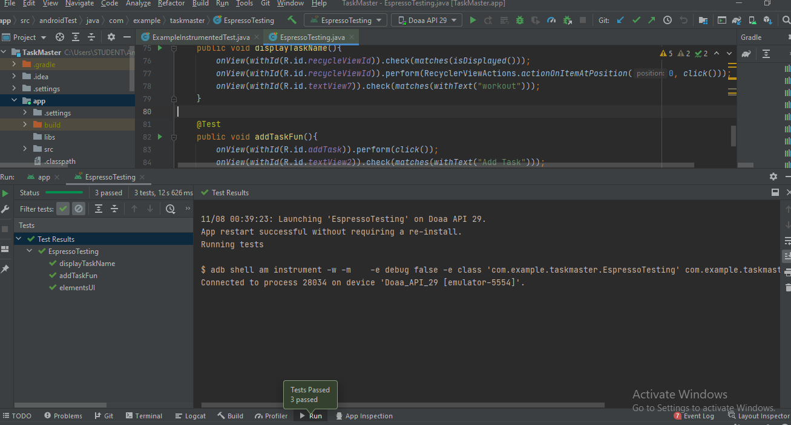

## Lab 32: Amplify and DynamoDB

In this lab I implemented **AWS amplify** to access the data in **DynamoDB** insted of **Room**.

### Add Task Activity

Now when the user add new task in the add task page, The task will stor in the **DynamoDb** data base and also in the room to reach it if the user offline.

### Main Activity

I refactored the homepage's **RecyclerView** to display all Task entities in **DynamoDB**.

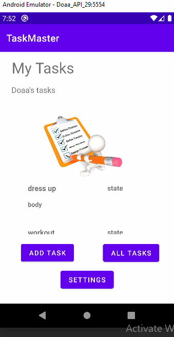

* This is screenshot for the tasks in the **DynamoDb**

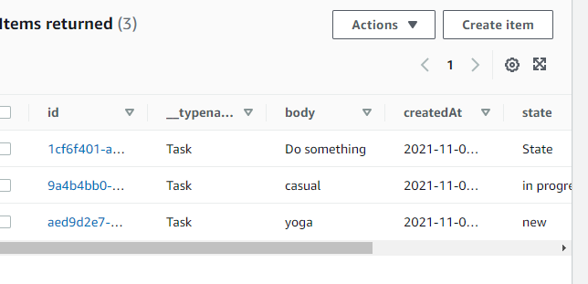

## Lab 33: Related Data

### Add Task Activity

Modify the Add Task form to include either a Spinner for which team that task belongs to.

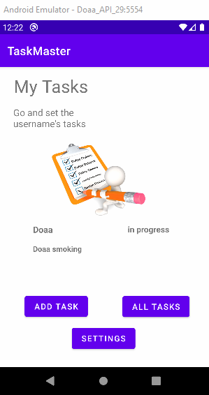

### Setting Activity

In addition to a username, allow the user to choose their team on the Settings page. Use that Team to display only that team’s tasks on the homepage.

### ### Main Activity

When the user chooses the team, the tasks will display on the home page, and at the top of the page, the team name will display.
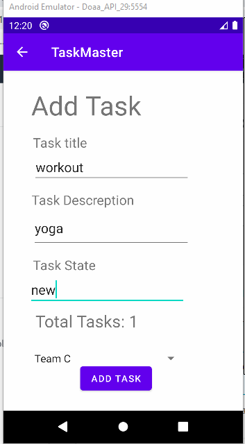

* Picturs below for **DynamoDB**:

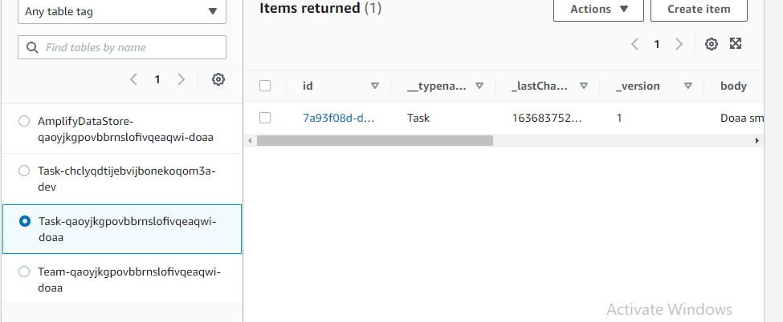

